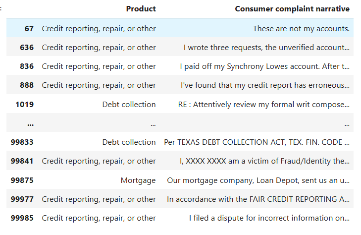
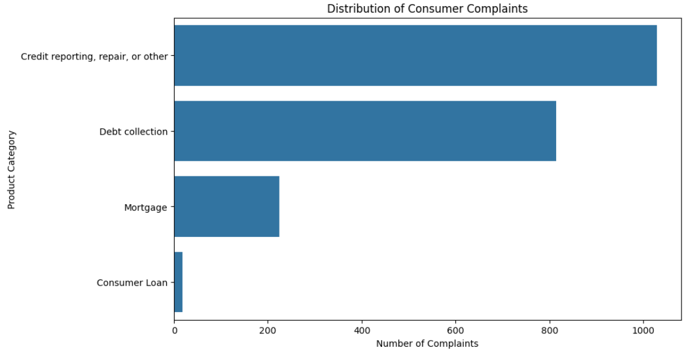
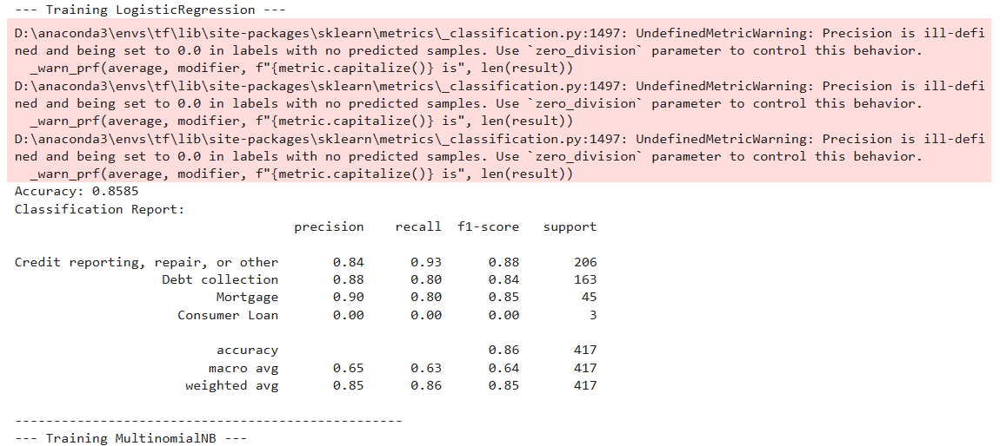
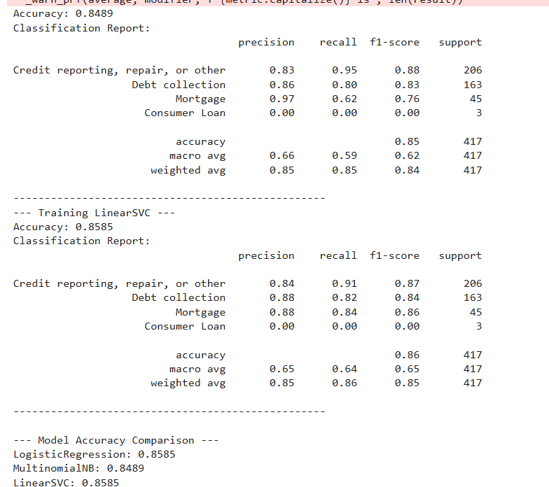

# 🤖 Kaiburr Assessment 2025 — Task 5  
## Text Classification on Consumer Complaint Dataset

### 📘 Overview
This project performs **Text Classification** on the **Consumer Complaint Database** from [Data.gov](https://catalog.data.gov/dataset/consumer-complaint-database).  
The goal is to classify consumer complaints into **four categories**:

| Label | Category |
|--------|-----------|
| 0 | Credit reporting, repair, or other |
| 1 | Debt collection |
| 2 | Consumer Loan |
| 3 | Mortgage |

The project applies the complete **Machine Learning pipeline**:
1. Exploratory Data Analysis (EDA)  
2. Text Pre-processing  
3. Feature Engineering  
4. Model Training & Comparison  
5. Evaluation Metrics  
6. Prediction on unseen text  

---

### 🧠 Tech Stack
| Component | Technology Used |
|------------|-----------------|
| Programming Language | Python 3.10+ |
| Libraries | pandas, numpy, matplotlib, seaborn, scikit-learn, nltk |
| ML Models | Logistic Regression, Random Forest, Naive Bayes |
| Text Vectorization | TF-IDF / CountVectorizer |
| Evaluation Metrics | Accuracy, Precision, Recall, F1-score, Confusion Matrix |
| IDE | Jupyter Notebook / VS Code |

---

## Screenshorts of Output

 
 
 
